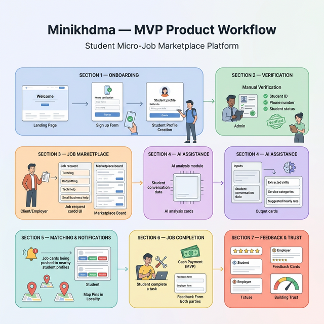

# MiniKhedma

A student micro-job marketplace that connects university students with local families and small businesses seeking short-term help such as tutoring, babysitting, tech support, and errands.

## MVP Workflow

The diagram below represents the complete MVP flow of the platform, from student onboarding through job completion and feedback collection.

## MVP Scope Summary

| Field | Detail |
|-------|--------|
| Project Name | MiniKhedma |
| Platform | Mobile application (iOS + Android via React Native) |
| Target Launch | One city, one university (Sidi Mohamed Ben Abdellah University — USMBA, Fes) |
| Timeline | 4-8 weeks to build and test the MVP |
| Core Hypothesis | Moroccan students possess undervalued everyday skills; AI-assisted skill discovery combined with local trust verification can convert those skills into paid micro-jobs. |

### Success Metrics (first 4-6 weeks)

| Metric | Target |
|--------|--------|
| Student sign-ups | 40-60 |
| Client sign-ups | 15-30 |
| Completed gigs | 20+ |
| Willingness to rebook | 40-70% |
| AI skill detection accuracy | 80% or higher (manual check) |

## MVP Features

### Student Side

- AI onboarding chat to extract skills from a guided conversation
- Simple student profile (name, university, available skills, photo)
- Location and availability settings
- Manual verification via student card upload and phone OTP
- Receiving and viewing job requests
- Basic in-app messaging with clients
- Job completion confirmation and post-job ratings

### Client Side

- Quick sign-up with minimal required fields
- Post a job request (description, category, location, timeframe)
- Browse nearby verified students
- In-app messaging with students
- Confirm gig assignment
- Cash payment at job completion
- Rate and review the student after the job

### Platform Features

- Simple matching engine based on skills and location proximity
- Push notifications for new gig opportunities
- Admin dashboard for manual student verification
- Report and block user functionality
- WhatsApp support link for issue resolution

## System Components (MVP)

| Component | Description |
|-----------|-------------|
| Mobile Application | Cross-platform client for students and employers to interact with the marketplace. |
| Backend API | Server-side application handling authentication, job management, matching, and data operations. |
| AI Skill Extraction Module | Processes the onboarding conversation to identify student skills, service categories, and suggested pricing. |
| Database | Central data store for user profiles, job listings, ratings, and verification records. |
| Admin Dashboard | Internal web interface for manual student verification and platform moderation. |
| Notification Service | Delivers push notifications to students when relevant job requests are posted nearby. |

## Technology Stack (Proposed)

| Layer | Technology |
|-------|------------|
| Mobile App | React Native |
| Backend | Node.js / Express or FastAPI |
| Database | PostgreSQL |
| AI Module | LLM API (Claude or OpenAI) |
| Authentication | Phone OTP (Twilio) |
| Notifications | Firebase Cloud Messaging |
| Admin Dashboard | React or Next.js |

## Launch Strategy

1. Manually onboard the first 50 students through in-person campus outreach.
2. Seed the first 20 clients from local families and small businesses near campus.
3. Distribute the platform through campus WhatsApp groups and student associations.
4. Manually seed early gigs if organic demand is insufficient during the initial launch period.
   

## Key Design Decisions

| Decision | Rationale |
|----------|-----------|
| Cash payment only | Avoids payment gateway complexity in the MVP; validates demand before integrating online payment. |
| Manual verification | Student card and phone OTP verified by an admin; automated ID verification deferred to post-MVP. |
| Simple messaging | Basic text-based chat; no media sharing or real-time indicators in the first version. |
| Scoped AI usage | AI is limited to skill extraction from the onboarding conversation and hourly rate suggestion; no autonomous matching or decision-making. |
| Single campus focus | Concentrating on one university ecosystem allows tight feedback loops and manageable operational overhead. |

## Scope Control

The MVP intentionally excludes several features in order to keep development focused and deliverable within the target timeline. The following capabilities are deferred to post-MVP iterations:

- In-app payment system
- Automated identity verification
- Complex AI matching algorithms
- Multi-city deployment
- Advanced reputation systems

These features will be considered after the core hypothesis has been validated and initial user feedback has been collected.
